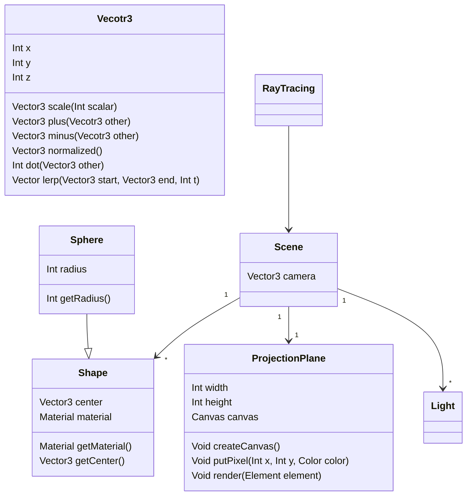
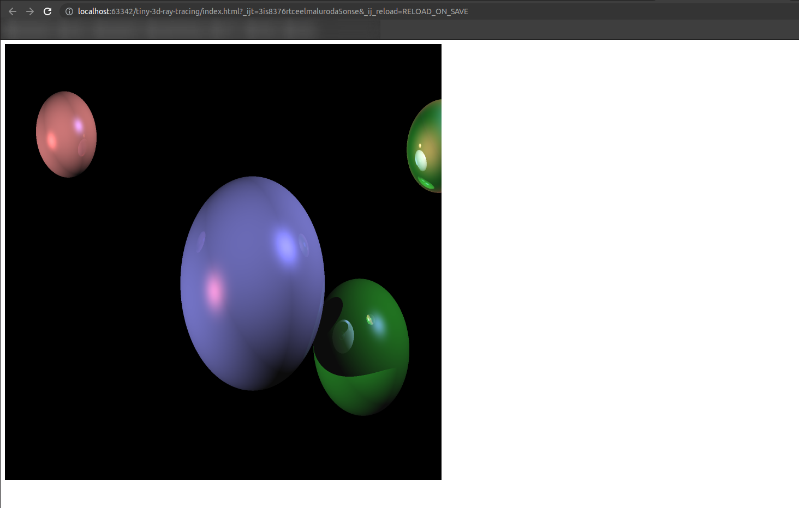

## UML Schema

```mermaid
classDiagram
    class Vecotr3 {
        Int x
        Int y
        Int z
        Vector3 scale(Int scalar)
        Vector3 plus(Vecotr3 other)
        Vector3 minus(Vecotr3 other)
        Vector3 normalized()
        Int dot(Vector3 other)
        Vector lerp(Vector3 start, Vector3 end, Int t)
    }

    class Shape {
        Vector3 center
        Material material
        Material getMaterial()
        Vector3 getCenter()
    }
    
    class Sphere {
        Int radius
        Int getRadius()
    }

    class Scene {
        Vector3 camera
    }

    class ProjectionPlane {
        Int width
        Int height
        Canvas canvas
        Void createCanvas()
        Void putPixel(Int x, Int y, Color color)
        Void render(Element element)
    }
    
    RayTracing --> Scene
    Scene "1" --> "*" Shape
    Scene "1" --> "1" ProjectionPlane
    Scene "1" --> "*" Light
    Sphere --|> Shape
```

## Output

