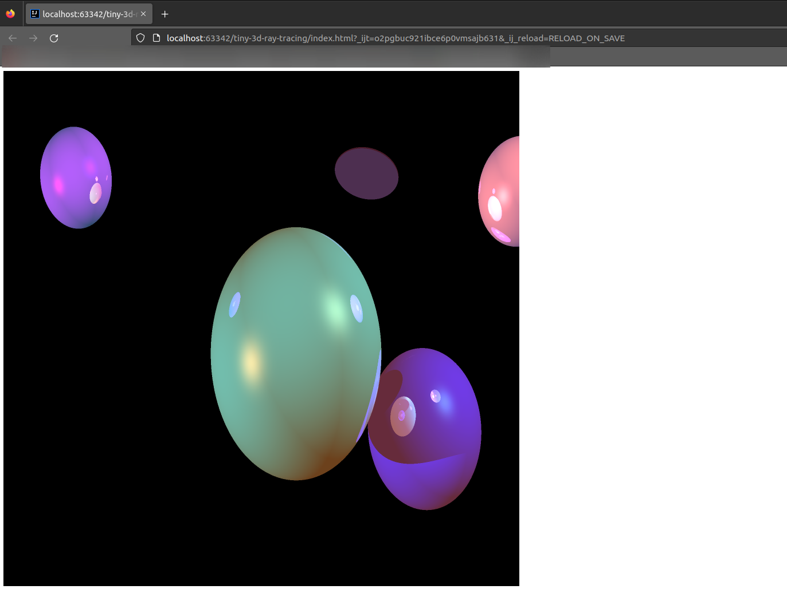
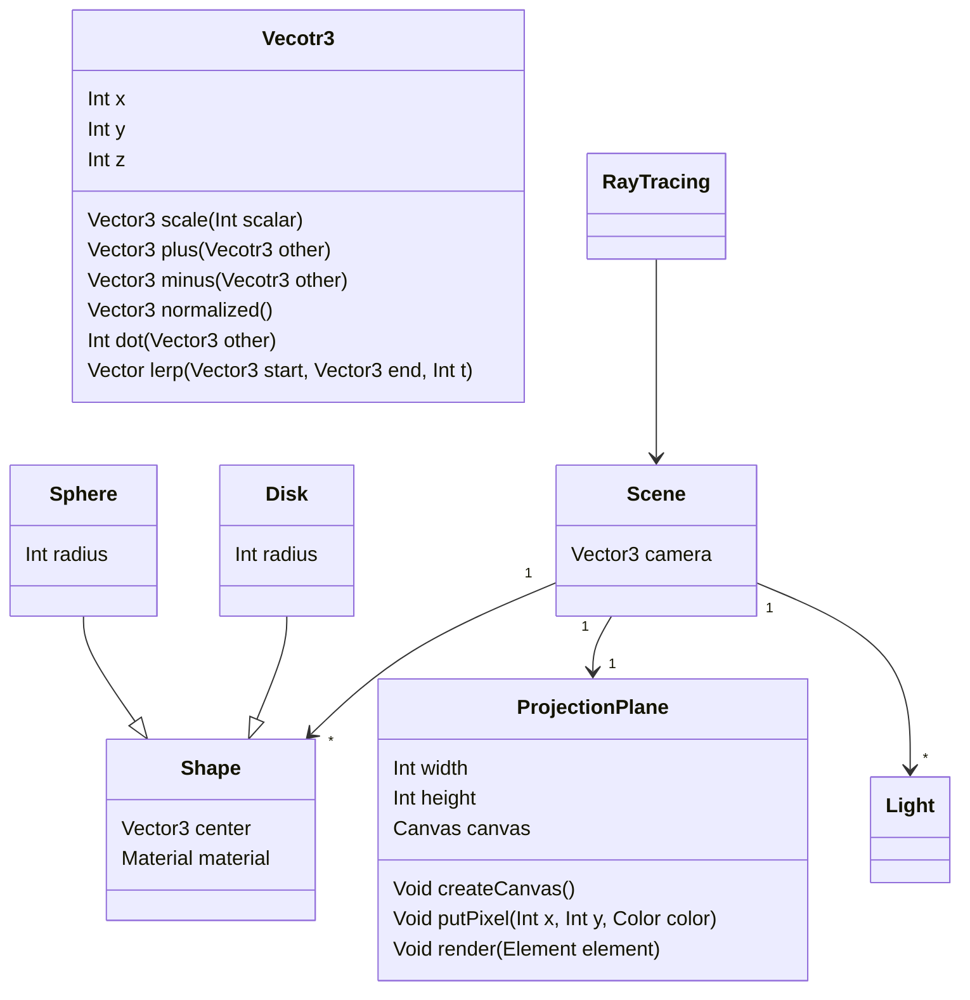

# Summary

A simple ray tracer written in javascript.

# Examples

A quick note, these test applications runs faster on firefox (than chrome).

## Example 1 - Simple Ray Tracing [900x900]

- ensure `const isMultiThreadingEnabled = false` on `index.js` then open `index.html`

## Example 2 - Ray tracing using Web Workers (16) [900x900]

- ensure `const isMultiThreadingEnabled = true` on `index.js` then open `index.html`

# UML Schema

# What's Next ?

- Optimize rendering system 
   - [x] use Web Workers
   - [ ] use `Möller–Trumbore intersection algorithm`

- Animation
   - [ ] Rotate Camera
   - [ ] move camera position
   - [ ] move light position
   - [ ] add *-Control (ScaleControl, RotateControl, TransitionControl)

- Rendering based 3D Objects
   - [x] Render Disk 
   - [ ] Render Plan 2D
   - [ ] Render Cube
   - [ ] add BufferShape based on Polygone
   - [ ] add BufferShape based on Triangle

# Annexe:
- https://fr.wikipedia.org/wiki/Algorithme_de_trac%C3%A9_de_segment_de_Bresenham
- https://cahier-de-prepa.fr/mp-charlemagne/download?id=771#:~:text=L'algorithme%20de%20Bresenham%20est,est%20autre%20que%20p0%20D%20
